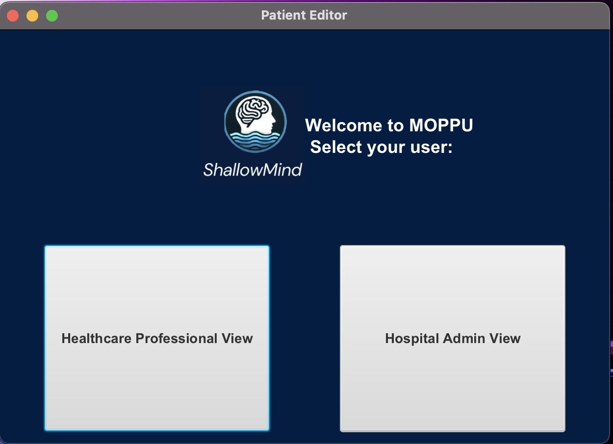
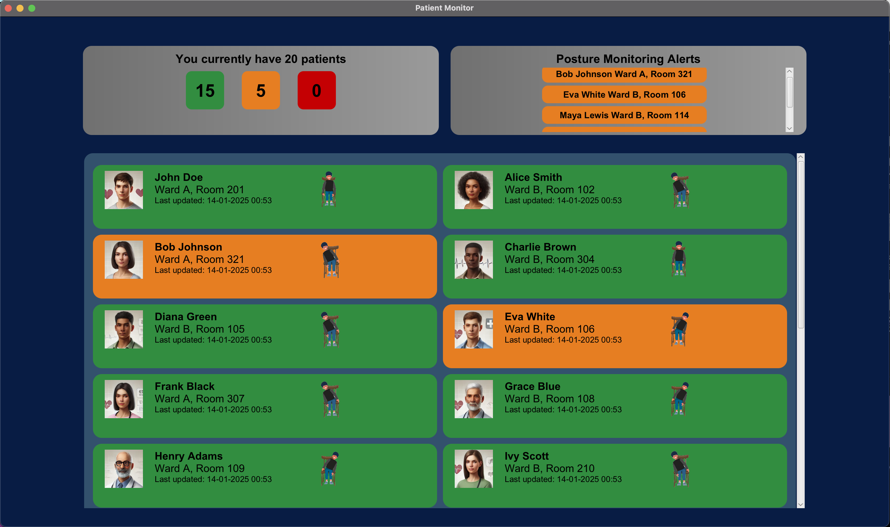

# MOPPU: Managing Orientation for Preventing Pressure Ulcers







## Table of Contents
1. [Introduction](#introduction)
2. [Features](#features)
3. [Installation](#installation)
4. [Dependencies and Requirements](#dependencies-and-requirements)
5. [Running the Application](#running-the-application)

---

## Introduction

**MOPPU** (Managing Orientation for Preventing Pressure Ulcers) is a Java-based software designed to help healthcare professionals prevent pressure ulcers in patients. By leveraging real-time data from pressure distribution devices, MOPPU monitors and displays patient posture, enabling timely interventions. The software also provides comprehensive patient information, including location, medication records, procedure schedules, and posture history, making it a versatile tool for hospital staff.

---

## Features

1. **Real-Time Posture Monitoring:**
   - Updates every minute with live posture data.
   - Color-coded alerts prioritize patients requiring intervention.

2. **Alert System:**
   - Notifies nurses when a patient’s posture exceeds safe durations.

3. **Patient Management:**
   - Displays patient details, including location, medication, schedules, and posture history.
   - Allows administrators to edit patient records.

4. **SQLite Integration:**
   - Efficient data management using a mock SQL database.

---

## Installation

1. Clone this repository:
   ```bash
   git clone https://github.com/Jackinfire/Shallowmind.git
   
2. Compile the Application

    ```bash
    javac -d out src/main/java/view/Home.java

 3. Run the Application

    ```bash
    java -cp out view.Home

---
    
## Dependencies and Requirements

### Software Requirements
- **Java Development Kit (JDK):**
   - Version 21. 
- **Gradle Build Tool:**
   - Required to build and run the project (or use the Gradle Wrapper provided in the project).


### System Requirements
- **Operating System:**
   - Windows, macOS, or Linux (supports JavaFX and Java).
- **Internet Access:**
   - Required for the initial build to download dependencies from Maven Central Repository.

### Dependencies
The project uses the following dependencies, which are managed via Gradle:

1. **JavaFX Controls**:
   - Version: `21`
   - Used for building the graphical user interface.
2. **SQLite JDBC Driver**:
   - Version: `3.42.0.0`
   - Enables interaction with SQLite databases.
3. **iText7 Core**:
   - Version: `7.2.5`
   - Used for generating and handling PDF documents.

### Gradle Plugins
- **Application Plugin**:
   - Used to package and run the application.
- **JavaFX Plugin**:
   - Version: `0.1.0`
   - Used for configuring JavaFX modules and dependencies.

---

## Running the Application

To run the application using Gradle, follow these steps:

1. Open a terminal and navigate to the project directory.
2. Use the following command to run the application:
   ```bash
   ./gradlew run
   ```

---

## Contributors

- **[Om Jitendra Mahajan](https://github.com/Jackinfire)**: Fullstack Developer
- **[Divij Vidhi Handa](https://github.com/divijvhanda)**: Fullstack Developer
- **[Yuichiro Minamikawa](https://github.com/yucheerio)**: Fullstack Developer
- **[Miles Caskey](https://github.com/micaskey)**: Fullstack Developer
- **[Joe Martin](https://github.com/joemavs)**: Fullstack Developer

---

## Request for the Assessor

- The app is simulating 1hr of data and updating every minute
- As per user requirements, amber alert only switches on after 5min and red after 20min of consecutive posture
- Hence to see the full App workings, one would need to wait a minimal of 20min (or change thread.sleep in LiveMonitor.java)
- THANK YOU!!

